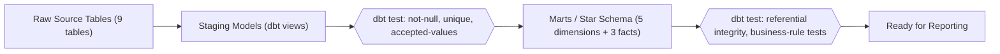
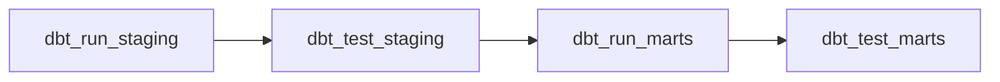
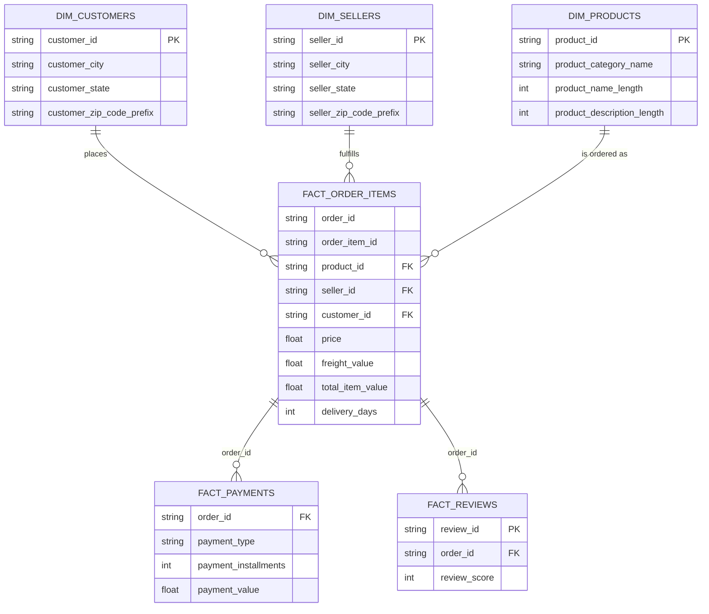
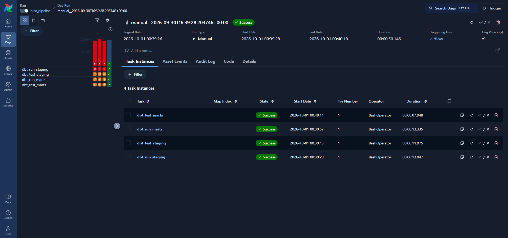

# Olist E-Commerce Analytics Engineering Pipeline

An end-to-end analytics engineering pipeline built on the Olist Brazilian E-Commerce public dataset, using **dbt Core**, **Snowflake**, and **Apache Airflow**. Built as a personal portfolio project to demonstrate practical data engineering and data quality practices: building a star schema, embedding automated data quality tests, tracking historical changes (SCD Type 2), and orchestrating the pipeline with Airflow in Docker.

## Tech Stack

- **Snowflake** - cloud data warehouse
- **dbt Core** - transformation, testing, and snapshots
- **Apache Airflow** - orchestration, containerized with Docker
- **Python / SQL**
- **Git / GitHub** - version control

## Architecture



Orchestrated end to end by an Airflow DAG:



Quality checks gate promotion between layers - if a test stage fails, the next run stage doesn't execute.

## Data Model


 
`dim_geolocation` and `dim_date` are standalone/conformed dimensions, not directly joined to the facts within the dbt models. `dim_geolocation` supports ad hoc joins by zip code (e.g. for map-based BI visuals), and `dim_date` is a generated calendar dimension for ad hoc time-based joins and reporting.
 
**Dimensions:** `dim_customers`, `dim_sellers`, `dim_products`, `dim_geolocation`, `dim_date`
 
**Facts:** `fact_order_items`, `fact_payments`, `fact_reviews`

## Data Quality

- **19 automated dbt tests**: `not_null`, `unique`, `relationships` (referential integrity), `accepted_values`, plus 2 custom singular tests (`assert_no_negative_prices`, `assert_delivery_after_purchase`).
- **3 real data quality defects found and fixed** during ingestion:
  - A CSV header-detection failure on load (Snowflake's upload wizard didn't parse headers correctly for one source file) - fixed by explicitly setting header/delimiter config on re-upload.
  - Genuine typos in the source data itself (`product_name_lenght`, `product_description_lenght`) - corrected via aliasing in the staging layer.
  - A many-to-one duplication issue in raw geolocation data - resolved with a window-function deduplication (`ROW_NUMBER()` partitioned by zip code).
- **Slowly Changing Dimension (Type 2)** history tracking on `dim_sellers.seller_state`, implemented via a dbt snapshot (`check` strategy) and verified with a live simulated data change.

  

## Orchestration

The pipeline is orchestrated by an Airflow DAG (`airflow/dags/olist_pipeline.py`), containerized with Docker. Verified running successfully end to end against the live Snowflake account:



### A note on getting here

Getting Airflow running wasn't smooth, and that troubleshooting process is part of what this project demonstrates. The Docker build initially failed with SSL errors on a corporate-managed laptop, traced to endpoint security software intercepting container network traffic - confirmed when IT-level certificate access was explicitly blocked. Moving to GitHub Codespaces fixed the build, but surfaced a separate Postgres connection-timeout issue between Airflow's API server and its metadata database, reproduced identically across multiple fresh cloud environments despite isolating executor type, network configuration, and environment freshness as variables. Re-testing the exact same setup on a personal, non-corporate laptop resolved it cleanly - confirming both issues were environment-specific, not flaws in the pipeline design itself.

## Setup

1. Create a Snowflake account and load the 9 raw Olist tables into a database (`OLIST`) and schema (`PUBLIC`).
2. Install dbt Core and the Snowflake adapter: `pip install dbt-core dbt-snowflake`
3. Configure `~/.dbt/profiles.yml` with your Snowflake credentials (see `olist_project/dbt_project.yml` for the profile name).
4. From `olist_project/`, run:
```
   dbt run
   dbt test
   dbt snapshot
```
5. To run via Airflow: from `airflow/`, create a `profiles.yml` with your Snowflake credentials (excluded from this repo via `.gitignore`), then:
```
   docker compose build
   docker compose up airflow-init
   docker compose up -d
```
   Open `http://localhost:8080`, enable the `olist_pipeline` DAG, and trigger a run.

## Repository Structure

```
olist-dbt-airflow-snowflake/
├── olist_project/          # dbt project (staging models, marts, snapshots, tests)
├── airflow/                # Airflow DAG, Dockerfile, docker-compose.yaml
└── docs/screenshots/       # Evidence screenshots
```